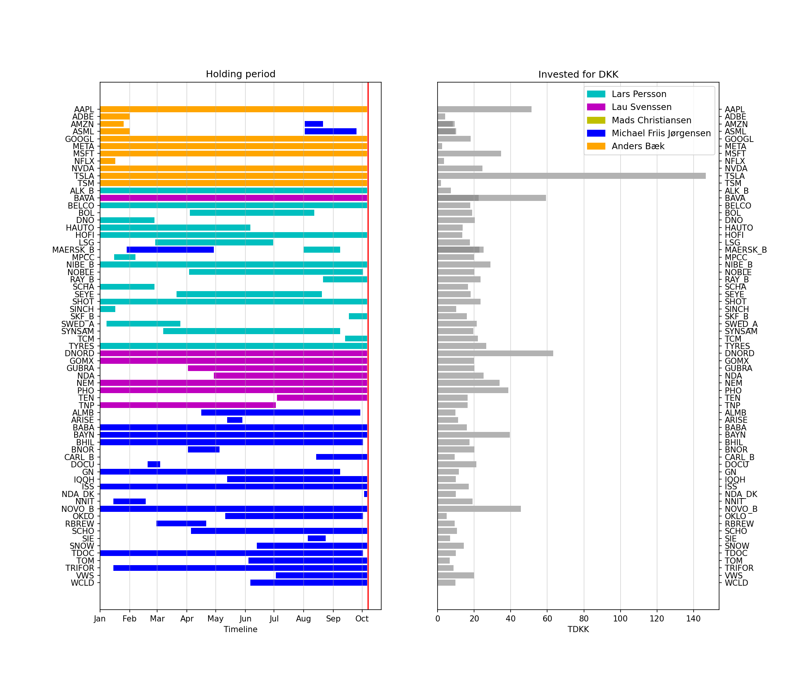

# Follow portfolio movements from participants in the Millionærklubben panel

The dl code goes into a cronjob, so e.g. each evening the webpage https://www.home.saxo/da-dk/campaigns/millionaerklubben is scraped.
The analysis produces a figure that displays the buy and sell events as some type of Gantt chart.

An example is below:

